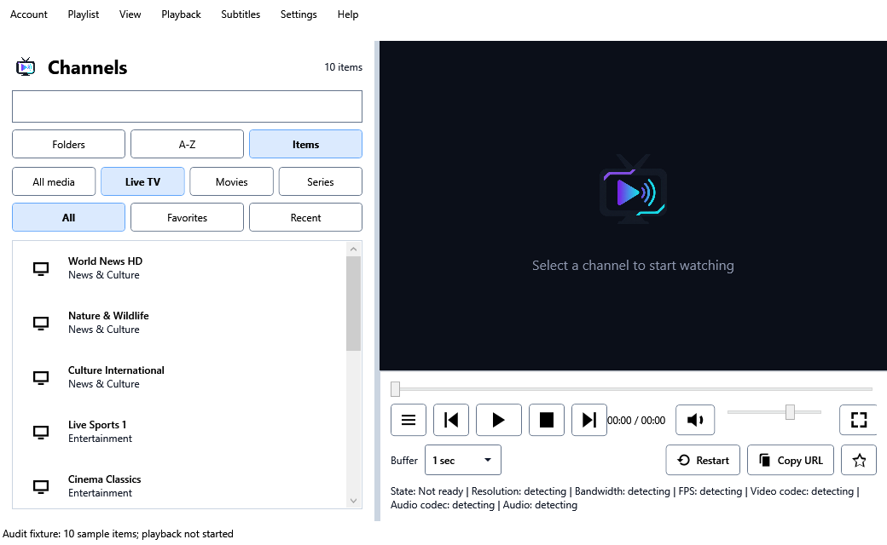

# Cyrus IPTV: product, UI and reliability audit

Audit started 20 September 2026; updated 21 September 2026. Implementation order and progress are in [ROADMAP.md](../ROADMAP.md).

## Assessment

Cyrus already covers the fundamentals of a Windows IPTV player: M3U and Xtream sources, live TV, movies, series, favorites, now/next guide, and embedded playback. Its strongest assets are the native desktop application, portable distribution and broad existing workflow coverage.

The main gap is how consistently those features work together. Browsing can overwrite playback-source state, interrupted refreshes can lose useful data, and recent history is not a complete return-to-watching flow. The UI gives many technical controls equal prominence while making search scope, account changes and recovery harder to understand.

The recommended direction is a reliable Windows player with clear Live TV / Movies / Series navigation, a useful programme guide and persistent viewing progress. Keep the current WPF/LibVLC foundation. Improve behavior before expanding into DVR, timeshift or multi-view.

## Scope and evidence

- Reviewed the actual working tree, including pre-existing changes to `Models.cs`, the Windows project file, `MainWindow.xaml` and its code-behind. Those edits belong to the existing workspace and were preserved.
- The Windows project reports version **0.7.0**; the core project has a separate version. Findings describe this working tree, not an assertion about every published build.
- The initial Windows Debug build passed with **0 warnings and 0 errors**, using .NET SDK 10.0.301 and existing packages.
- Core parser and failure cases were exercised using synthetic data and in-memory provider responses. No personal accounts, saved credential files or live provider subscriptions were used.
- Competitor research uses official product sites, repositories and store listings checked on 20 September 2026. This is a feature/workflow comparison, not a hands-on speed, stability or popularity ranking.
- UI findings combine XAML/event-flow review and isolated WPF layout renders where noted below. Native video output, full playback, Narrator, actual monitor scaling and provider compatibility still need integration checks.

## First implementation completed

Roadmap step 01 is complete as of 21 September. The parser now retains adjacent programme fields and every matching channel alias, keeps first nonempty repeated text, validates numeric/UTC/GMT/BST zones and timestamp bounds, and skips invalid or nonpositive programme intervals. Aliases share a programme list rather than inflating its count.

All **48 regression checks pass**; the Windows Debug build passes with **0 warnings and 0 errors**. See the [regression instructions and supported-format limits](../tests/README.md). The XMLTV format permits named zones; its documentation explicitly defines BST as +0100. [Official XMLTV DTD](https://github.com/XMLTV/xmltv/blob/master/xmltv.dtd)

Finding M06 below records the original failure and is addressed by this slice. Other findings remain open. Native playback/provider testing was not performed, and cancellation here remains cooperative between parser reads. **Next implementation: 02a, healthy-stream reconnect failure.**

## Rendered UI evidence

These images render the actual WPF controls with ten invented channels and an isolated demo account. They capture client content at 96 DPI, without window chrome, native video playback or provider networking. The layout checks do not replace a live monitor/DPI/accessibility test.

| Capture | Content size | Observation |
| --- | --- | --- |
| [Library, light](audit/2026-09-20/current-library-light.png) | 1480 × 860 | Large control area and ten filter buttons compete with browsing/video space. |
| [Library, dark](audit/2026-09-20/current-library-dark.png) | 1480 × 860 | Theme tokens work; standard sliders/scrollbars still deserve contrast and visual consistency checks. |
| [Compact library](audit/2026-09-20/current-library-compact.png) | 1040 × 640 | Measured Now Playing label width is **9 DIP**; the player control area is 177 DIP tall. The title effectively disappears. |
| [Account setup](audit/2026-09-20/current-accounts-light.png) | 780 × 620 | Even the short M3U form scrolls; initial status/update choices sit below the initial viewport. |

## Current feature inventory

“Present” means implemented in source; it does not imply a full provider/device certification. “Partial” identifies a concrete missing part of an otherwise implemented feature.

| Area | Current status | What is implemented / what remains |
| --- | --- | --- |
| Source setup | Present, with usability gaps | Multiple saved accounts; Xtream URL/credentials and HTTP M3U URL; custom EPG URL. No local playlist-file import, setup connection test or reliable draft editing. |
| Xtream catalog | Present, with failure gaps | Live/movie categories and on-demand series/episodes. Partial API failure can discard series, and episodes lack a durable structured library identity. |
| Playlist compatibility | Partial | M3U Plus attributes, logos, groups, media classification. Comma-bearing names can truncate; playlist HTTP-header directives and embedded EPG-source attributes are not applied. |
| Library navigation | Present, with scale gaps | Multiword search, folder/A–Z/item views, media filters and breadcrumbs; virtualized list. Search index is allocated but unused, full results cap at 50,000, and browser state is not consistently retained. |
| Favorites | Present, with identity gaps | Persistent favorites and newly added favorite folders in the working tree. Account scoping, stable IDs and consistent selected-versus-playing actions need work. |
| Recent history | Partial | Stores up to 20 played items, but the view filters the current catalog rather than displaying complete chronological history. Resolved episodes can be absent. |
| Playback | Present, with recovery defects | LibVLC, pause/stop/seek, previous/next, fullscreen, mute, 0–150% volume, buffer presets and reconnect attempts. Healthy-stream recovery has a retry-index defect; replacement VOD players do not restore progress automatically. |
| Live pause | Limited | Tracks paused/behind-live elapsed time and restarts at live edge. No application-managed rolling buffer, durable live rewind or guaranteed timeshift window. |
| EPG | Partial | XMLTV/GZIP, ID/name matching, current/next programme and descriptions. Initial parser defects reproduced; step 01 addresses parsing. Grid, manual mapping, scheduled refresh and persistent guide cache remain absent. |
| Movies and series | Partial | Playback and on-demand episode fetching. No saved Resume/Start Over flow, watched status, Continue Watching, full season model, rich details or next-episode experience. |
| Tracks and video preferences | Partial | Embedded subtitle selection and local subtitle files. No exposed audio-track/language preferences, timing adjustment, playback speed or full video-options UI. |
| Appearance/accessibility | Partial | Light/dark themes, scalable WPF layout, resizable sidebar and fullscreen OSD. Missing accessible names, keyboard breadcrumbs, dependable keyboard seeking and compact reflow. |
| Diagnostics and updates | Present, with gaps | Stream metrics, logs, optional GitHub checks and release-page links. Redaction has a reproduced flaw; crash output needs the same sanitation policy. No automatic install/update mechanism. |
| Advanced TV | Absent in app | Provider catch-up, instant/scheduled recording, disk-backed timeshift, multi-view, casting and household profiles. These are independent future capabilities. |

Primary code: [core models](../src/ClassicWindowsIptvPlayer.Core/Models.cs), [playlist service](../src/ClassicWindowsIptvPlayer.Core/PlaylistService.cs), [main window](../src/ClassicWindowsIptvPlayer.Windows/MainWindow.xaml.cs), [tuner](../src/ClassicWindowsIptvPlayer.Windows/ChannelTuner.cs).

## Free and paid benchmarks

There is no single best player for all platforms. For this product, **IPTVnator is the closest broad free desktop comparison**; **Kodi** is a mature TV/guide architecture reference; **VLC** is a playback-control reference. **TiviMate, Sparkle TV and iPlayTV** are useful references for the TV viewing experience. Their native platforms and pricing models matter when comparing capabilities.

| Product | Platforms and payment model | Verified strengths to compare | Qualification |
| --- | --- | --- | --- |
| **IPTVnator** | Windows/macOS/Linux; free, open source; browser/PWA variant | M3U/Xtream/Stalker, XMLTV timeline, global search, favorites/history, resume, phone remote and downloads | Desktop and browser capabilities differ; embedded MPV is experimental. [Official repository](https://github.com/4gray/iptvnator) |
| **Kodi + IPTV Simple** | Windows and other desktop/TV platforms; free, open source | Multiple M3U/XMLTV sources, groups, radio, TV guide, provider catch-up and configurable stream inputs | IPTV Simple is an add-on. Local buffering uses additional inputstream support; DVR depends on the backend/client rather than Kodi's name alone. [Kodi platforms](https://kodi.tv/about/), [IPTV Simple](https://github.com/kodi-pvr/pvr.iptvsimple), [PVR architecture](https://kodi.wiki/view/PVR) |
| **VLC** | Windows and other desktop/mobile platforms; free, open source | Broad playback, audio/subtitle controls, synchronization, speed, aspect/deinterlace and stream-to-file tools | Reviewed desktop docs do not establish an integrated Xtream catalog or XMLTV grid. General stream output is not a scheduled IPTV DVR. [Desktop controls](https://docs.videolan.me/vlc-user/desktop/3.0/en/gettingstarted/desktopoverview/windows_and_linux/menu_bar.html), [Stream output](https://docs.videolan.me/vlc-user/desktop/3.0/en/advanced/stream_out_introduction.html) |
| **Smarters Pro** | Windows/macOS v1.0 beta plus mobile/TV/web variants; desktop price/tier unspecified on reviewed site | Advertises multiple playlists, M3U/JSON, movies/series, favorites and parental controls | Marketing combines platforms; do not assume Windows parity with every advertised mobile feature. Compare the actual Windows beta before assigning guide/DVR/multiview parity. [Official product/downloads](https://smarterspro.com/) |
| **TiviMate** | Android TV; free install with paid Premium/IAP; exact official price/tier split not visible | TV guide, M3U/Xtream/Stalker, multiple playlists, favorites, catch-up, recording, search, parental controls and multiview | Designed for remote navigation rather than touch. The reviewed listing does not establish generic local pause/rewind buffering. [Official Google Play listing](https://play.google.com/store/apps/details?id=ar.tvplayer.tv&hl=en) |
| **Sparkle TV** | Android/Google/Fire TV; free Basic and paid Plus | Guide, audio/subtitles, search and frame-rate matching; Plus lists DVR scheduling, timeshift, VOD/catch-up, multiple sources, favorites and multiview | Official site displays **$1.49/month, $7.99/year or $20.99 once**. These are displayed dollar prices, not a verified German checkout quote. [Official tiers/pricing](https://www.sparkleplayer.com/), [Platforms](https://play.google.com/store/apps/details?id=se.hedekonsult.sparkle&hl=en) |
| **Televizo** | Android phone/tablet/TV; free with ads; one-time Premium and one-hour Premium trial | Multiple playlists, EPG, catch-up, Chromecast, favorites, sorting and track selection; Premium adds backup/restore, parental controls and ad removal | Official amount not visible. Five-device activation is licensing, not evidence of automatic library synchronization. [Store features](https://play.google.com/store/apps/details?id=com.ottplay.ottplay), [Premium terms](https://televizo.net/premium-version.html) |
| **iPlayTV** | Apple TV; **$5.99 upfront** in the US App Store | Remote/file/Xtream playlists, cross-playlist search, reordered favorites, channel preview, EPG/time correction, track selection, Xtream catch-up and AirPlay 2 | This listing is for Apple TV. DVR and multiview were not established by the reviewed listing. Price varies by storefront. [Official App Store listing](https://apps.apple.com/us/app/iplaytv-iptv-m3u-player/id1072226801) |

The lesson is broader than adding premium features. IPTVnator's v0.23.0 notes document preserving catalog scroll position, manual EPG mapping, movie-source recovery, consistent player controls and retaining partial recordings after crashes. These are useful examples of finishing everyday workflows. They also show that a phone remote alone is not a unique differentiator. [Official release notes](https://github.com/4gray/iptvnator/releases/tag/v0.23.0)

| User need | Cyrus today | Benchmark direction | Roadmap |
| --- | --- | --- | --- |
| Choose something before playing it | Basic list; guide only for current channel | Browseable now/next and full guide | 08, 10–11 |
| Return to a movie or series tomorrow | Recent list; no persistent position | Resume, watched state and episode progression | 04, 12–13 |
| Survive an unreliable provider | Retry mechanism with defects; blocking refresh | Correct recovery, cached fallback and actionable errors | 02a, 06–07 |
| Control comfortably from the couch | Fullscreen controls | Predictable keyboard focus and readable state | 07–08 |
| Organize a large personal library | Basic folders/favorites and global state | Stable identity, ordering, backup/restore | 04, 09, 16 |
| Watch an earlier programme | Live pause tracking only | Provider catch-up, then separate recording/timeshift systems | 17–20 |

These recommendations are our product judgment based on the comparison and local findings. They are not measured claims that one competitor is faster or more stable.

## Confirmed mechanics problems

Priorities: **P0** = fix before broader feature development; **P1** = daily-use reliability/usability; **P2** = workflow expansion. Source references describe the audited baseline; line numbers may move during implementation.

| ID / priority | Reproduction or evidence | Impact and remedy |
| --- | --- | --- |
| M01 / P0 | `ChannelTuner.RunTuneCycleAsync`: after >=30 s of healthy playback, `attempt = 0`; retry delay then indexes `Math.Min(attempt, length) - 1`, producing -1. Source-confirmed control flow; native-stream reproduction pending. | A live error/end can become an exception and terminal failure instead of reconnecting. Separate retry budget from delay index. **Next: 02a.** |
| M02 / P0 | Play A, single-select B. `ChannelList_SelectionChanged` calls `BuildSourceList`, replacing the shared candidate state. Details/copy read those candidates while the current channel stays A. Source-confirmed. | Diagnostics and URL commands can describe the wrong stream. Separate selected-library state from the active playback session. **03.** |
| M03 / P0 | Synthetic malformed input containing `password=sample-secret` returns `password=***sample-secret` from `SanitizeUrl`. The value remains present. Reproduced through the actual core method. | Redaction can leak the exact secret it claims to hide. Fix value matching and apply redaction to exception/crash output. **02b.** |
| M04 / P0 | Synthetic Xtream refresh: existing live+episode catalog, categories `[]`, series endpoint HTTP 503. Result contains only live content. Reproduced with an in-memory HTTP handler. | Optional endpoint failure can erase series on refresh. Preserve last-good content and distinguish unavailable from successfully empty. **06.** |
| M05 / P0 | `ConfigStore.Save`/cache save delete the old destination before moving a temporary file; load failure silently creates defaults. Source-confirmed. | Interrupted writes/corruption can lose account/library state. Atomic replacement, schema versioning, backup recovery and visible recovery status. **04.** |
| M06 / P1 | Compact XMLTV with adjacent title/description/category loses description; a second display-name alias fails to match; `+9900` throws and aborts the guide. All reproduced with actual core methods. | Valid guide information disappears and one bad record can break the feed. Streaming parser/timestamp corrections and regression checks. **01.** |
| M07 / P1 | M3U name `News, Weather` becomes `Weather` because parsing uses the last comma. Reproduced through actual core parsing. | User-visible names and identities are wrong. Find the metadata/name separator while respecting quoted attributes. **06.** |
| M08 / P1 | Playlist and episode loads use `CancellationToken.None`; some core broad catches swallow cancellation; UI lacks a cancel action. Source-confirmed. | Slow or superseded work can outlive the intended account/navigation state. Cancellation, request generations, body deadlines and cached fallback. **06.** |
| M09 / P1 | Tuner replacement creates a new media/player without recording VOD position. The pause-specific UI path is the only application seek-back mechanism. Source-confirmed. | Recovery can restart a movie. Track last-confirmed position; distinguish normal completion from truncated end. **07, 12.** |
| M10 / P1 | Favorites/folders/history are global; series placeholder identity omits account; other IDs depend on mutable names/full URLs. Source-confirmed. | Accounts can collide, while refreshed names/tokens can orphan favorites. Introduce stable account/item keys and migration. **04.** |
| M11 / P1 | `_searchIndex` is constructed but never queried; filter path scans/materializes results and caps the item view at 50,000. Source-confirmed. | Startup pays for unused indexing; very large lists can be incomplete and expensive. Measure the real path, use index/virtualization and expose every result. **09.** |
| M12 / P1 | `RefreshEpgAsync` clears the current guide on refresh error. No persistent guide cache or refresh schedule. Source-confirmed. | An outage removes otherwise usable information. Retain a visibly stale guide and refresh in the background. **10.** |
| M13 / P1 | Credentials and full source URLs were stored in JSON/GZIP beside the app. Source-confirmed at audit time. | Protect local storage and provide explicit secret-free export. GZIP is compression, not encryption. **04.** |

Code evidence: [ChannelTuner.cs](../src/ClassicWindowsIptvPlayer.Windows/ChannelTuner.cs), [MainWindow.xaml.cs](../src/ClassicWindowsIptvPlayer.Windows/MainWindow.xaml.cs), [AppLogger.cs](../src/ClassicWindowsIptvPlayer.Core/AppLogger.cs), [PlaylistService.cs](../src/ClassicWindowsIptvPlayer.Core/PlaylistService.cs), [ConfigStore.cs](../src/ClassicWindowsIptvPlayer.Core/ConfigStore.cs), [EpgService.cs](../src/ClassicWindowsIptvPlayer.Core/EpgService.cs).

The synthetic audit harness under ignored `release/audit-core` records initial defects; it is not a permanent passing regression suite. Committed tests added for step 01 should assert corrected behavior. Do not interpret the audit harness's successful exit as proof the original behavior was correct.

## UI and complete viewing journey

### 1. Open an account

The account dialog combines account selection, editing and initial setup. Switching selection replaces unsaved fields; Add/Remove/selection persist immediately, while Cancel suggests a draft can be discarded. Removing an account immediately removes its cache. Opening account management stops playback even if the dialog is canceled. The global Enter handler invokes Continue despite focus being on another control.

Build a simple account chooser with “Open” and “Manage accounts”; use explicit drafts in the editor, field-level validation, a clear Save action and undo/confirmation for removal. Show last successful refresh, cache availability and useful provider errors. Keep current playback until another account is actually opened. [Login behavior](../src/ClassicWindowsIptvPlayer.Windows/LoginWindow.xaml.cs), [account dialog](../src/ClassicWindowsIptvPlayer.Windows/LoginWindow.xaml).

### 2. Load or refresh

The progress overlay explains that work is happening but blocks the window without a cancel action. A failed load can produce an exception dump. Refresh should preserve usable content, show the stage and allow Cancel, Retry or Use saved library. Only a validated replacement should replace the working catalog; late results must not cross accounts. [Loading flow](../src/ClassicWindowsIptvPlayer.Windows/MainWindow.xaml.cs).

### 3. Find something

Ten filter buttons across three rows compete with the search field. The search field has no visible label, hint, clear action or Ctrl+F shortcut. “Channels” remains the framing for movies and series. Empty/favorites/recent/search states lack dedicated explanation and recovery. Breadcrumb links are mouse-only text handlers.

Make Live TV / Movies / Series the primary navigation. Put categories and favorites in the sidebar, with one secondary view/sort control. Label search and state whether it searches all content or the current scope. Keep the selected row, the playing indicator and favorite control visually distinct. Provide Reset filters and useful empty states. Restore scroll/selection when returning from a series/details view. [Library XAML](../src/ClassicWindowsIptvPlayer.Windows/MainWindow.xaml), [filter/breadcrumb code](../src/ClassicWindowsIptvPlayer.Windows/MainWindow.xaml.cs).

### 4. Watch comfortably

The permanent control area includes transport, time, volume, buffer, restart, copy URL, favorites and a wrapping diagnostics paragraph. This consumes video space and makes occasional maintenance actions as prominent as watching. Fixed-width controls are vulnerable at narrow sizes; the 1040-DIP minimum with a 440-DIP sidebar leaves only about 595 DIP for the player before padding.

Use a compact primary bar with play/pause, channel or seek actions, volume, title and fullscreen. Put tracks, video options, restart, raw URL copying and diagnostics in a menu or details panel. Show a live badge/Go Live only for live content; use duration/progress/Resume for VOD. Show connecting/retrying/error status close to the player with an actionable recovery button.

Keyboard slider changes currently do not seek because only mouse release commits playback time. The active fullscreen handler uses Up/Down for hidden list selection, contrary to the README's volume promise. Controls can hide while focused or dragged. Fix these behaviors before changing visual styling. [Player layout](../src/ClassicWindowsIptvPlayer.Windows/MainWindow.xaml), [seek/fullscreen handlers](../src/ClassicWindowsIptvPlayer.Windows/MainWindow.xaml.cs).

### 5. Discover programmes

Now/next is useful while watching but does not help choose another channel. Descriptions require hover. Start by adding now/next to browsed live channels and accessible programme details. Then add the grid, date navigation and search. Guide loading, stale data, unmatched channels and missing source configuration need distinct states and a repair action. Only surface catch-up/recording once the app and provider can support the action.

### 6. Come back later

Recent needs to be an actual chronological history. A movie should open with Resume or Start Over; a series should identify the next episode and show watched progress. Save progress during playback and on pause/close, using stable account/item identity. Allow dismissing Continue Watching items. Preserve navigation context after playback ends.

### Cross-cutting design requirements

| Area | Requirement |
| --- | --- |
| Accessibility | Automation names for icon buttons/sliders; associated form labels; real keyboard-focusable breadcrumb controls; visible focus; selected-state semantics; Narrator checks. |
| Responsive desktop | Reflow controls rather than raising the minimum size; check 100/125/150/200% scaling and compact windows; keep video aspect ratio; preserve sidebar width. |
| Theme | Keep existing theme tokens; check foreground/background/focus contrast in both themes; use consistent spacing and action hierarchy. |
| Settings | Categorized settings for Playback, Guide, Accounts and Appearance; show selected values; make advanced diagnostics optional. |
| Feedback | Separate status from errors; show the operation that failed, preserve context and offer a next action. Do not expose stack traces in ordinary product flows. |
| Branding | Decide “Cyrus IPTV” versus “Classic Windows IPTV Player” before changing title, icon, packages, update repository or documentation. |

## Architecture improvements tied to outcomes

The main window currently handles filtering, series navigation, playback-session UI, account loading, favorites, settings and updates. Extract these responsibilities incrementally around the steps that need them: library/query state, playback-session state, account drafts and persistence, guide state. Small services/view models with explicit cancellation and command targets will make the fixes testable. A wholesale MVVM conversion is not a prerequisite.

The existing tuner already attempts generation-based supersession, bounded startup, fresh native player ownership and background teardown. Preserve that work and verify edge cases. The current monitor listens for terminal events; a stream that stalls without a terminal event requires progress/stall detection and a provider/engine test, not just increasing retry count.

Add deterministic parser/network tests before depending on the guide or catalog for recording. Add native playback fixtures for tune/cancel/stop/reconnect/pause/resume and teardown. Measure startup/search on representative catalogs; do not assume constructing an index or setting virtualization flags proves acceptable responsiveness.

## What to build first

1. **Step 01:** correct guide parsing and add regression checks. This is the first implementation accompanying this audit.
2. **Step 02a:** correct healthy-stream reconnect failure.
3. **Step 02b:** fix diagnostic redaction, then separate selection from playback and protect persistence/account edits.
4. Finish cancellable refresh and keyboard playback mechanics before redesigning navigation.
5. Add the guide and Continue Watching before recording, timeshift or multi-view.

The [roadmap](../ROADMAP.md) contains the full checklist, dependencies, acceptance criteria and proposed performance budgets. Budgets are targets for future measurement, not present-day benchmark results.

## Terminology for future features

- **Provider catch-up:** requests archived programmes from a provider; availability, URL scheme and archive window depend on that provider.
- **Local recording:** saves an incoming stream. Scheduling adds durable jobs, conflicts, sleep/restart behavior and disk management.
- **Local timeshift:** keeps a bounded rolling buffer while the app runs. Pause duration tracking alone does not provide it.
- **Multi-view:** opens simultaneous streams and needs sufficient provider connections and local decoding resources.

Kodi's IPTV Simple documentation explicitly separates provider archives from local inputstream buffering. Keep that distinction in Cyrus's UI and release notes. [Official inputstream/catch-up documentation](https://github.com/kodi-pvr/pvr.iptvsimple)
